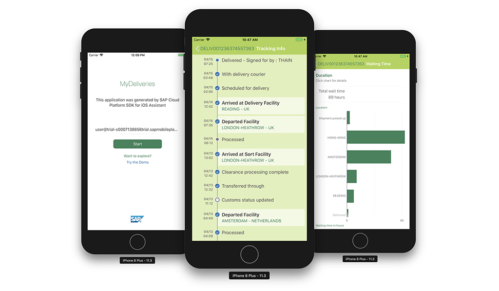
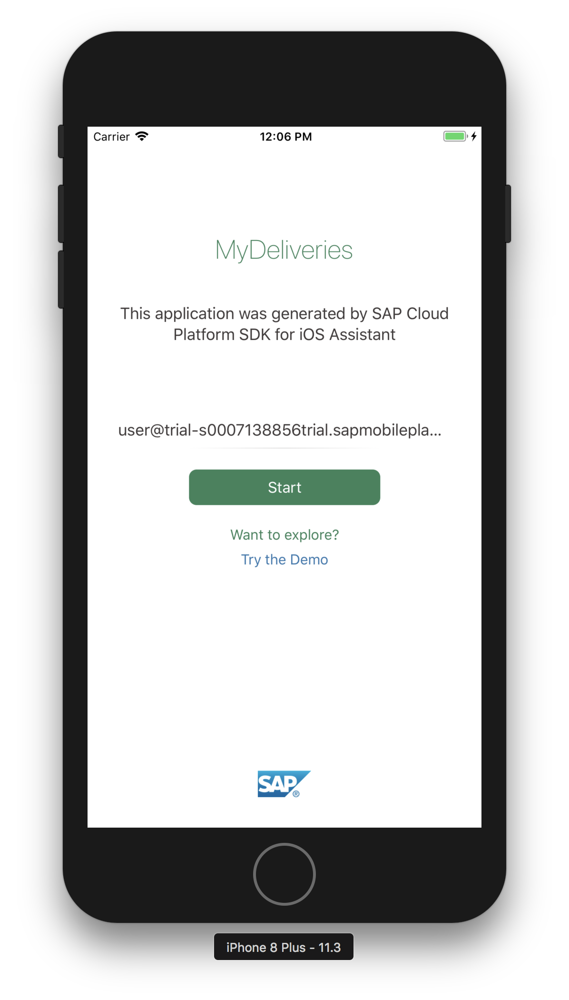
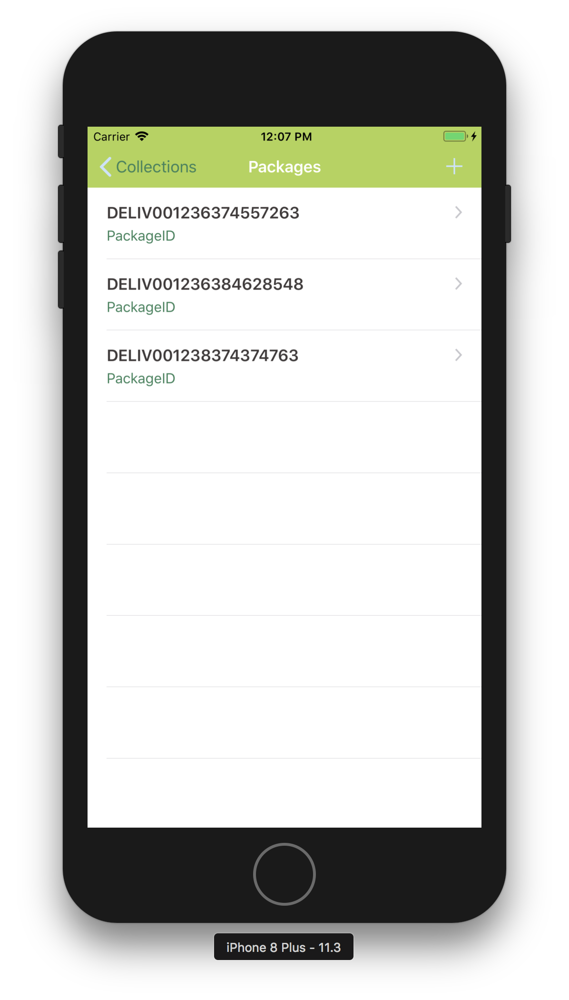
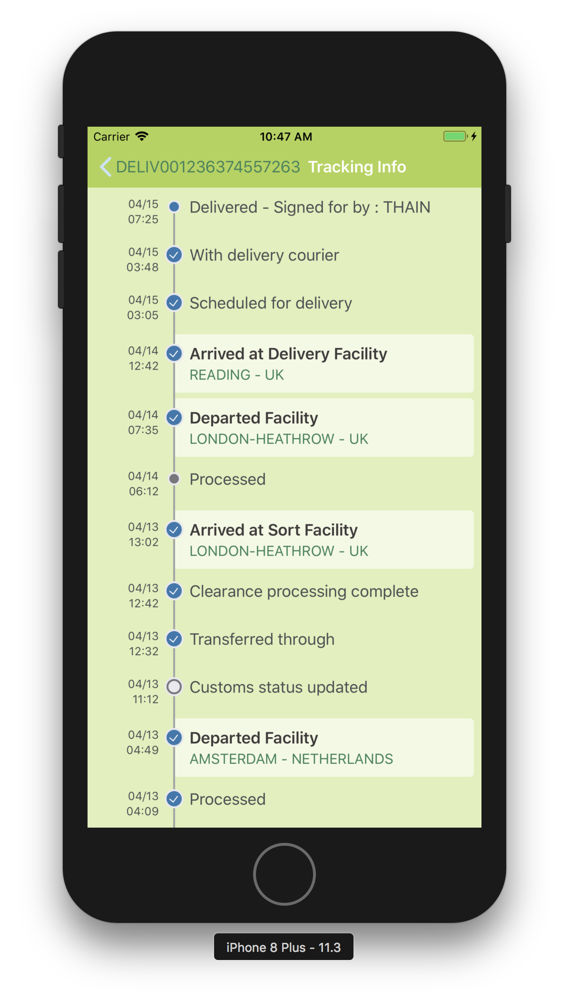
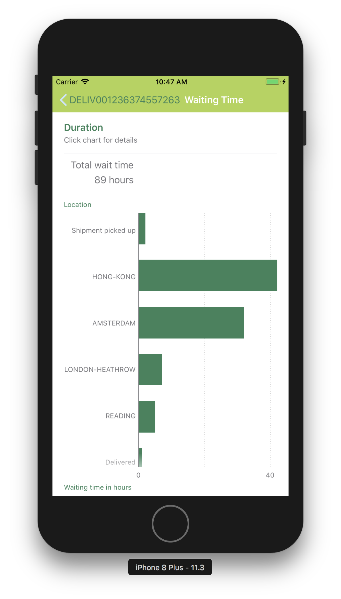

## Prerequisites  
- **Proficiency:** Intermediate
- **Tutorials:** [Sign up for a free trial account on SAP Cloud Platform](https://www.sap.com/developer/tutorials/hcp-create-trial-account.html) and [Enable SAP Cloud Platform mobile service for development and operations](https://www.sap.com/developer/tutorials/fiori-ios-hcpms-setup.html)
- **Development environment:** Apple iMac, MacBook or MacBook Pro running Xcode 9.3 or higher
- **SAP Cloud Platform SDK for iOS:** Version 2.1

## Details
### You will learn  
In this tutorial, you will create a Fiori for iOS application which will show tracking info for purchased packages. This application has the following characteristics:

 - Connects to an SAP HANA MDC (Multi-tenant Database Container) XS OData service. It contains records of packages and their delivery status.
 - Use simplified OData querying with the SAP Cloud Platform SDK for iOS
 - Implement SAP Fiori for iOS controls to show timeline data
 - Displays deliveries turnaround times in a bar chart
 - Custom theming

When you are ready, your SAP Fiori for iOS application will resemble the following:

> Before you start, make sure you:

> - have downloaded SAP Cloud Platform SDK for iOS **version 2.1 (2.0 SP01)** or earlier. If you have downloaded the latest **version 2.2 (2.0 SP02)** of the SDK, please go to [this tutorial](https://www.sap.com/developer/tutorials/fiori-ios-scpms-create-app-wwdc.html) instead.
> - have a trial account on SAP Cloud Platform. See [Sign up for a free trial account on SAP Cloud Platform](https://www.sap.com/developer/tutorials/hcp-create-trial-account.html) for more information.
> - enabled SAP Cloud Platform mobile service for development and operations. See [Enable SAP Cloud Platform mobile service for development and operations](https://www.sap.com/developer/tutorials/fiori-ios-hcpms-setup.html) for more information.

### Time to Complete
**50 Min**

---

[ACCORDION-BEGIN [Step 30: ](Build and run the app)]

First, remove the app from your device, so you will go through the onboarding again.

Then build and run the app.

When launched, you should now see the restyled on-boarding screen with the greenish theme:

If you proceed further, you will see the navigation bar is also styled:

And, unsurprisingly, the custom UI you have created earlier follows the same theme:

> For more on theming SAP Fiori for iOS components, see [Branding & Theming](https://help.sap.com/doc/978e4f6c968c4cc5a30f9d324aa4b1d7/Latest/en-US/Documents/Frameworks/SAPFiori/Branding%20and%20Theming.html)

> For more on `NUI`, see [NUI readme](https://github.com/tombenner/nui/)

[DONE]

[ACCORDION-END]
